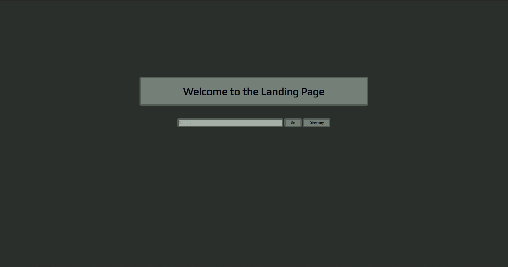
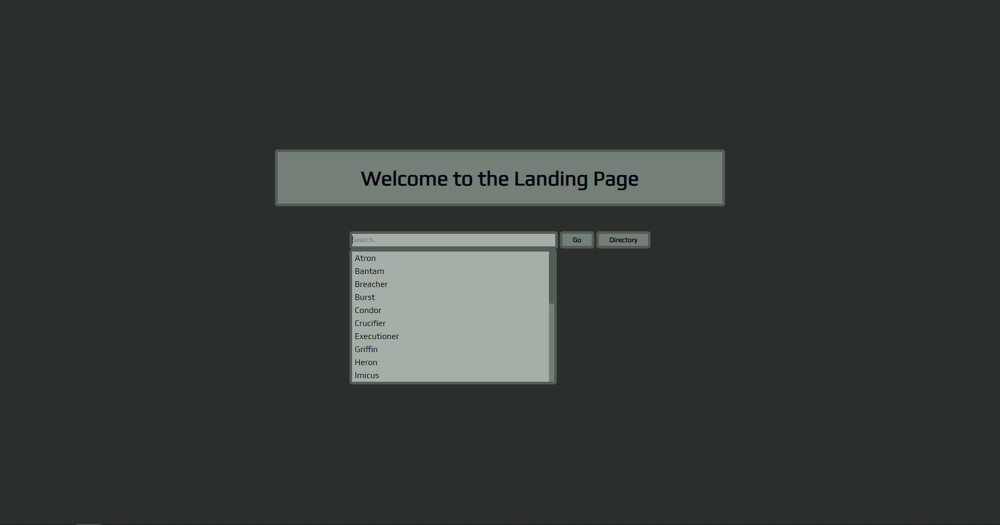
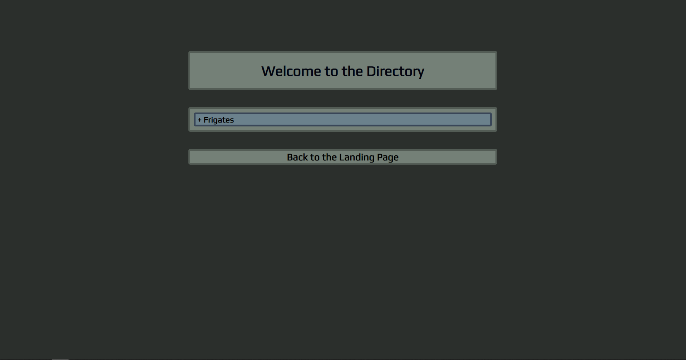
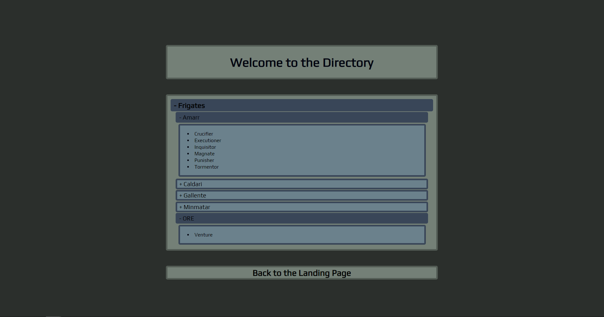
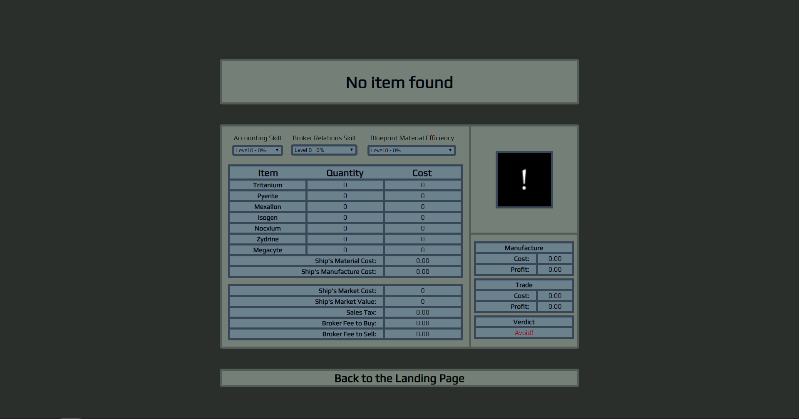
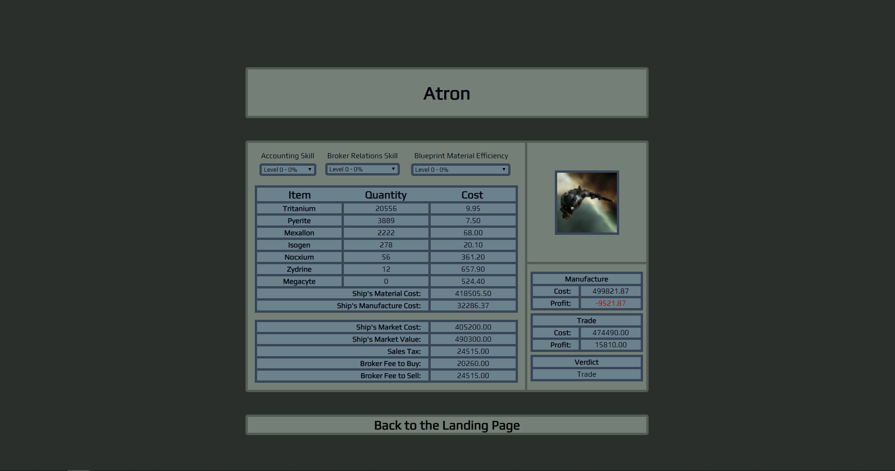
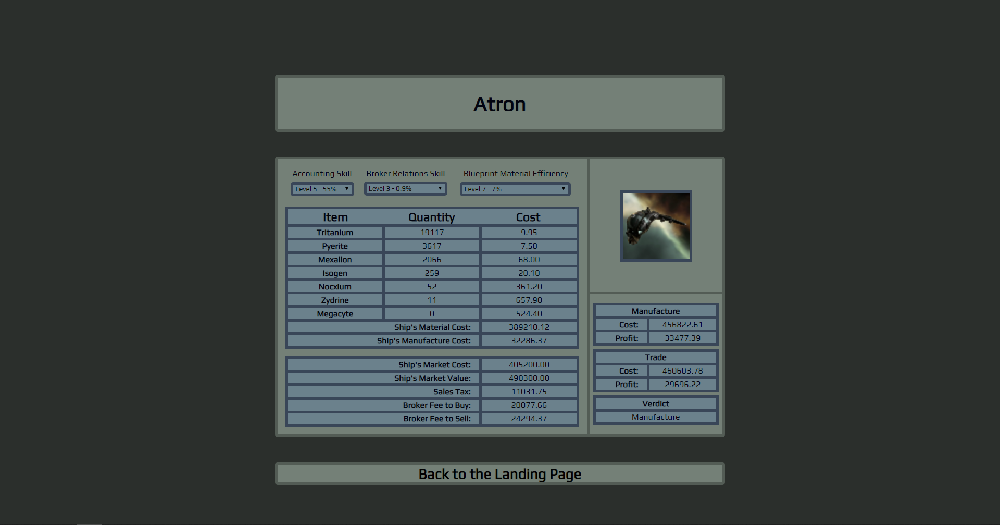

# CSI3140_Project

## Synopsis
Current plan is to use EVE Online's available API and downloadable data assets to create a tool to check if an item
is profitable to trade or to manufacture. The user should be able to change settings based on their own trained skills
that will affect the calculated and shown data.

## UI Design System
### Colour Palette
Colour palette found using coolors.co:
  * #02040F - Off-black for text
  * #2B2F2C - Dark-grey for page backgrounds
  * #748077 - Light-green for content background
  * #535C55 - Dark-green for content border
  * #6B818C - Light-blue for UI element background
  * #394658 - Dark-blue for UI element border
  * #A30303 - Dark-red for text emphasis
  
### Fonts and Type Scale
The main font will be from Google's font service, named Play (https://fonts.google.com/specimen/Play). 

The type scale was decided using type-scale.com and will be Minor Third (1.200):
  * 2.488em for page header
  * 1.728em for page footer (return to main page)
  * 1.44em for column header
  * 1.2em for second header
  * 1em for basic text

### Icons (and other images)
Images will be obtained through EVE Online's developer resources (developers.eveonline.com/resource/resources) and are stored in csi3140project/images.

Images will be bordered using the dark-blue to match other elements onpage (tables).

### Buttons and Form Elements
Buttons will use the lighter blue background and be bordered using the darker blue with rounded corners. As will the tables.

Forms will use the lighter and darker green with rounded corners. 

Dropdown lists will match their parent's formatting as much as possible but option lists are browser dependent.

Colours will alternate on click/hover/active for buttons.

### UI Components (e.g. popups)
No popups are used but an accordion-style dropdown list is implemented. Depending on the number of levels the Blues will be used for the level headers with '+' to denote that it can be opened and '-' to denote that it can be closed. The lowest level be a single container which will include a list with clickable items.

### Example Pages
  * [Landing Page](LandingPage.php)
  * [Directory](Directory.php)
  * [Search Results](SearchResults.php)
  
## Deployment + Test Instructions
  * Download and install XAMPP (located at https://www.apachefriends.org/index.html)
    * Linux: 'chmod 755 xampp-linux-%version%-installer.run' then 'sudo ./xampp-linux-%version%-installer.run'
  * Start XAMPP
    * Windows: Open XAMPP Control Panel and start Apache + MySQL services.
    * Linux: Run command 'sudo /opt/lampp/lampp start'
  * Extract csi3140project.zip and copy it into the htdocs folder (default location: C:\xampp\htdocs)
    * Windows: default location: C:\xampp\htdocs
    * Linux: default location: /opt/lampp/htdocs
  * Open a browser and navigate to localhost/phpadmin
    * Create a csi3140project database. Then import 'csi3140project.sql' into that database.
  * Navigate to localhost/csi3140project
    * If setup succeeded then the webpage should match example images (as shown below), if not then the login settings may need to be changed in index.php, Directory.php, and SearchResults.php
    * At the time of the screenshots below, the remote API had a bad pull of data and so values are showing as 0. Hopefully this gets corrected by the time you are able to implement the project. Values can be compared against https://market.fuzzwork.co.uk/.
- - - -

- - - -
## Features Implemented
### Index
  * Searchbar filters based on input
  * Searchbar autopopulates from item database
  * Go button only works with valid inputs from populated list
  
### Directory
  * Custom-made accordion-style collapsible
  * Second level of collapsible autopopulates from database using races table
  * Third level of collapsible autopopulates from database using item table
  
### SearchResults
  * Default values implemented for when non-valid or no input is given when reaching the page
  * Dropdown options affect appropriate table values and update decisions and totals immediately
  * Image and data pulled from API, database, and image folder with valid input
  * Verdict field tells user which option, manufacture or trade, is best with given values
  
## Development Plan
### Stage 1 - Complete
Mock up webpage design and styling.
Get basic webpage running locally for development.
Figure out webserver and deployment plan.

### Stage 2 - Complete
Acquire and host data for static market database and item database.
Populate dropdown menus using item database.
Program client-side calculations for calculating item buy/sell costs based on skill levels, tax rates, and market database.
Give a visual indication if sell value is greater than buy value by acceptable amount (~10% until properly calculated).

### Stage 3 - Complete
Change static market database into dynamic database using API pulls.
Pulls information from two separate website APIs, https://market.fuzzwork.co.uk/aggregates/, and https://api.eve-industry.org/job-base-cost.xml.

### Stage 4 - In-progress
Use more static databases to look into manufacturing costs of items to see if manufacturing is cheaper than buying the item and if there's a greater profit margin there. <b>(Complete)</b>.
Add options for other market sources besides the main market.
Add options for manufacturing location for variable tax rates instead of using default values.
See how frequently market information can be pulled from API.<b>(Complete)</b>. Market information is pulled each time the SearchResults page is loaded.

### Stage 5
Think about adding login capability to automatically pull character information.

## Contributors
Carter Wallace - 6444010
